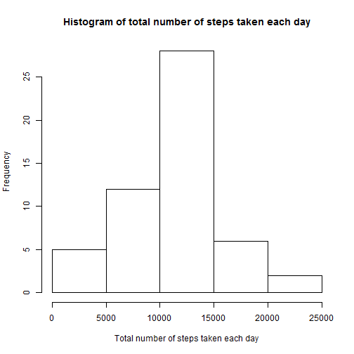
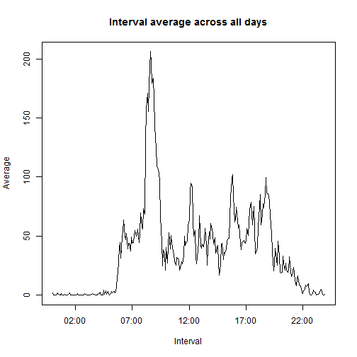

<!-- 
 echo = TRUE is used at each code chunk as demanded by the assignment requirements
 ...When writing code chunks in the R markdown document, 
 always use echo = TRUE so that someone else 
 will be able to read the code... 
-->


```r
library( dplyr )
```

```
## 
## Attaching package: 'dplyr'
## 
## The following object is masked from 'package:stats':
## 
##     filter
## 
## The following objects are masked from 'package:base':
## 
##     intersect, setdiff, setequal, union
```

## Loading and preprocessing the data

First it is necessary to load raw data from file activity.csv within root of archive activity.zip placed at current directory:


```r
zipfilename <- "activity.zip"
if( !file.exists( zipfilename ) )
{
    stop( paste( zipfilename, "does not exist in current directory" ) )
}
raw <- read.csv( unz(zipfilename, "activity.csv"), header=T )
```

Now, it worth to look at the data from different points of view:

```r
head( raw )
```

```
##   steps       date interval
## 1    NA 2012-10-01        0
## 2    NA 2012-10-01        5
## 3    NA 2012-10-01       10
## 4    NA 2012-10-01       15
## 5    NA 2012-10-01       20
## 6    NA 2012-10-01       25
```

```r
str( raw )
```

```
## 'data.frame':	17568 obs. of  3 variables:
##  $ steps   : int  NA NA NA NA NA NA NA NA NA NA ...
##  $ date    : Factor w/ 61 levels "2012-10-01","2012-10-02",..: 1 1 1 1 1 1 1 1 1 1 ...
##  $ interval: int  0 5 10 15 20 25 30 35 40 45 ...
```

```r
summary( raw )
```

```
##      steps                date          interval     
##  Min.   :  0.00   2012-10-01:  288   Min.   :   0.0  
##  1st Qu.:  0.00   2012-10-02:  288   1st Qu.: 588.8  
##  Median :  0.00   2012-10-03:  288   Median :1177.5  
##  Mean   : 37.38   2012-10-04:  288   Mean   :1177.5  
##  3rd Qu.: 12.00   2012-10-05:  288   3rd Qu.:1766.2  
##  Max.   :806.00   2012-10-06:  288   Max.   :2355.0  
##  NA's   :2304     (Other)   :15840
```

It is obvious that there are some NA values.
Exactly, their amount is

```r
rawnas <- sum(is.na(raw$steps))
rawnas
```

```
## [1] 2304
```

Calculate percent of NAs in whole set of observations:

```r
rawnrow <- nrow(raw)
rawnaspercent <- rawnas * 100 / rawnrow
rawnaspercent
```

```
## [1] 13.11475
```

Part of the NAs is 13.11% taking into account that whole amount of observations is 
17568.
Observations where steps is NA will be ignored being agree with opinion at https://class.coursera.org/repdata-014/forum/thread?thread_id=33#post-166 (NA means that value is unknown, so it can not be replaced with any real value and should not be taken into account)

Prepare tidy data set where NA are absent

```r
tidy <- raw[!is.na(raw$steps),]
```
Here are different points of view on the data:

```r
head( tidy )
```

```
##     steps       date interval
## 289     0 2012-10-02        0
## 290     0 2012-10-02        5
## 291     0 2012-10-02       10
## 292     0 2012-10-02       15
## 293     0 2012-10-02       20
## 294     0 2012-10-02       25
```

```r
str( tidy )
```

```
## 'data.frame':	15264 obs. of  3 variables:
##  $ steps   : int  0 0 0 0 0 0 0 0 0 0 ...
##  $ date    : Factor w/ 61 levels "2012-10-01","2012-10-02",..: 2 2 2 2 2 2 2 2 2 2 ...
##  $ interval: int  0 5 10 15 20 25 30 35 40 45 ...
```

```r
summary( tidy )
```

```
##      steps                date          interval     
##  Min.   :  0.00   2012-10-02:  288   Min.   :   0.0  
##  1st Qu.:  0.00   2012-10-03:  288   1st Qu.: 588.8  
##  Median :  0.00   2012-10-04:  288   Median :1177.5  
##  Mean   : 37.38   2012-10-05:  288   Mean   :1177.5  
##  3rd Qu.: 12.00   2012-10-06:  288   3rd Qu.:1766.2  
##  Max.   :806.00   2012-10-07:  288   Max.   :2355.0  
##                   (Other)   :13536
```

## What is mean total number of steps taken per day?
### Calculate the total number of steps taken per day

```r
daysteps <- group_by( tidy, date ) %>% summarize( totalsteps = sum( steps ) )
```
Here are different points of view on the data:

```r
head( daysteps )
```

```
## Source: local data frame [6 x 2]
## 
##         date totalsteps
## 1 2012-10-02        126
## 2 2012-10-03      11352
## 3 2012-10-04      12116
## 4 2012-10-05      13294
## 5 2012-10-06      15420
## 6 2012-10-07      11015
```

```r
str( daysteps )
```

```
## Classes 'tbl_df', 'tbl' and 'data.frame':	53 obs. of  2 variables:
##  $ date      : Factor w/ 61 levels "2012-10-01","2012-10-02",..: 2 3 4 5 6 7 9 10 11 12 ...
##  $ totalsteps: int  126 11352 12116 13294 15420 11015 12811 9900 10304 17382 ...
##  - attr(*, "drop")= logi TRUE
```

### Histogram of the total number of steps taken each day

```r
hist(daysteps$totalsteps, xlab="Total number of steps taken each day", main="Histogram of total number of steps taken each day")
```

 

### Calculate and report the mean and median of the total number of steps taken per day
Calculate mean and median

```r
daystepsmean <- mean( daysteps$totalsteps )
daystepsmedian <- median( daysteps$totalsteps )
```
Mean is 10766.189 and median is 10765

## What is the average daily activity pattern?
### Make a time series plot (i.e. type = "l") of the 5-minute interval (x-axis) and the average number of steps taken, averaged across all days (y-axis)

#### Prepare data for the plot
The data will have two variables: interval as POSIXct and steps average across all days.

Add new variable which is interval represented as POSIXct (the same date is used).
Example: interval is 1205 - new variable is "DATE 12:05".

```r
tidy <- mutate( tidy, posixctinterval=as.POSIXct( paste0( trunc( interval / 100, 0 ), ":", interval %% 100 ) , "%H:%M", tz="GMT" ) )
```

Calculate average steps per posixctinterval across all days.

```r
iavg<-group_by( tidy, posixctinterval ) %>% summarize( stepsavg = mean( steps ) )
```

#### Make the plot

```r
plot( iavg$posixctinterval, iavg$stepsavg, type = "l", 
      main = "Interval average across all days", 
      xlab = "Interval", ylab = "Average" )
```

 

### Which 5-minute interval, on average across all the days in the dataset, contains the maximum number of steps?

```r
format( iavg[iavg$stepsavg==max(iavg$stepsavg), ]$posixctinterval, "%H:%M" )
```

```
## [1] "08:35"
```

## Imputing missing values
Total number of missing values in the dataset (i.e. the total number of rows with NAs) is 2304 which is 13.11%

Fill missing values with average for a day

```r
na <- raw[is.na(raw$steps),]
dateavg <- group_by( tidy, date ) %>% summarize( avg = mean( steps ) )
```

### Create a new dataset that is equal to the original dataset but with the missing data filled in
### Make a histogram of the total number of steps taken each day and Calculate and report the mean and median total number of steps taken per day. Do these values differ from the estimates from the first part of the assignment? What is the impact of imputing missing data on the estimates of the total daily number of steps?

## Are there differences in activity patterns between weekdays and weekends?
### Create a new factor variable in the dataset with two levels – “weekday” and “weekend” indicating whether a given date is a weekday or weekend day
### Make a panel plot containing a time series plot (i.e. type = "l") of the 5-minute interval (x-axis) and the average number of steps taken, averaged across all weekday days or weekend days (y-axis). See the README file in the GitHub repository to see an example of what this plot should look like using simulated data


