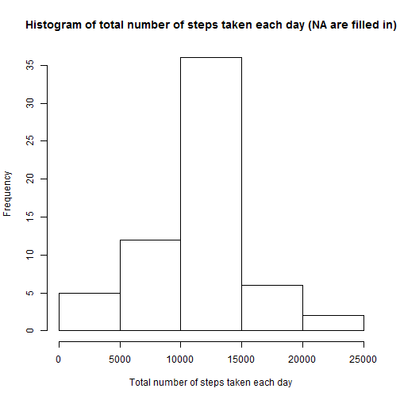
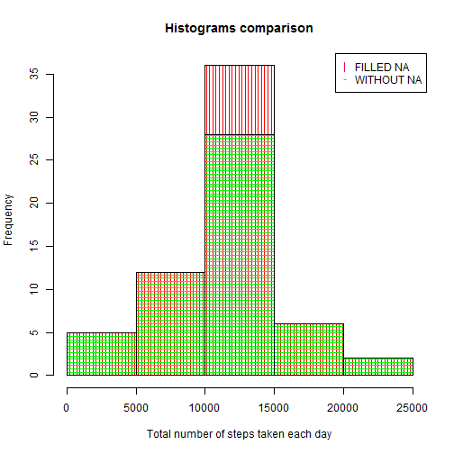
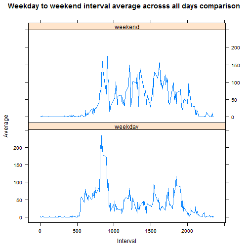

<!-- 
 echo = TRUE is used at each code chunk as demanded by the assignment requirements
 ...When writing code chunks in the R markdown document, 
 always use echo = TRUE so that someone else 
 will be able to read the code... 
-->


```r
library( dplyr )
library( lattice )
```

## Loading and preprocessing the data

First it is necessary to load raw data from file activity.csv within root of archive activity.zip placed at current directory:


```r
zipfilename <- "activity.zip"
if( !file.exists( zipfilename ) )
{
    stop( paste( zipfilename, "does not exist in current directory" ) )
}
raw <- read.csv( unz(zipfilename, "activity.csv"), header=T )
```

Now, it worth to look at the data from different points of view:

```r
head( raw )
```

```
##   steps       date interval
## 1    NA 2012-10-01        0
## 2    NA 2012-10-01        5
## 3    NA 2012-10-01       10
## 4    NA 2012-10-01       15
## 5    NA 2012-10-01       20
## 6    NA 2012-10-01       25
```

```r
str( raw )
```

```
## 'data.frame':	17568 obs. of  3 variables:
##  $ steps   : int  NA NA NA NA NA NA NA NA NA NA ...
##  $ date    : Factor w/ 61 levels "2012-10-01","2012-10-02",..: 1 1 1 1 1 1 1 1 1 1 ...
##  $ interval: int  0 5 10 15 20 25 30 35 40 45 ...
```

```r
summary( raw )
```

```
##      steps                date          interval     
##  Min.   :  0.00   2012-10-01:  288   Min.   :   0.0  
##  1st Qu.:  0.00   2012-10-02:  288   1st Qu.: 588.8  
##  Median :  0.00   2012-10-03:  288   Median :1177.5  
##  Mean   : 37.38   2012-10-04:  288   Mean   :1177.5  
##  3rd Qu.: 12.00   2012-10-05:  288   3rd Qu.:1766.2  
##  Max.   :806.00   2012-10-06:  288   Max.   :2355.0  
##  NA's   :2304     (Other)   :15840
```

It is obvious that there are some NA values.
Exactly, their amount is

```r
rawnas <- sum(is.na(raw$steps))
rawnas
```

```
## [1] 2304
```

Calculate percent of NAs in whole set of observations:

```r
rawnrow <- nrow(raw)
rawnaspercent <- round( rawnas * 100 / rawnrow, 2 )
rawnaspercent
```

```
## [1] 13.11
```

Part of the NAs is 13.11% taking into account that whole amount of observations is 
17568.
Observations where steps is NA will be ignored being agree with opinion at https://class.coursera.org/repdata-014/forum/thread?thread_id=33#post-166 (NA means that value is unknown, so it can not be replaced with any real value and should not be taken into account)

Prepare tidy data set where NA are absent

```r
tidy <- raw[!is.na(raw$steps),]
```
Here are different points of view on the data:

```r
head( tidy )
```

```
##     steps       date interval
## 289     0 2012-10-02        0
## 290     0 2012-10-02        5
## 291     0 2012-10-02       10
## 292     0 2012-10-02       15
## 293     0 2012-10-02       20
## 294     0 2012-10-02       25
```

```r
str( tidy )
```

```
## 'data.frame':	15264 obs. of  3 variables:
##  $ steps   : int  0 0 0 0 0 0 0 0 0 0 ...
##  $ date    : Factor w/ 61 levels "2012-10-01","2012-10-02",..: 2 2 2 2 2 2 2 2 2 2 ...
##  $ interval: int  0 5 10 15 20 25 30 35 40 45 ...
```

```r
summary( tidy )
```

```
##      steps                date          interval     
##  Min.   :  0.00   2012-10-02:  288   Min.   :   0.0  
##  1st Qu.:  0.00   2012-10-03:  288   1st Qu.: 588.8  
##  Median :  0.00   2012-10-04:  288   Median :1177.5  
##  Mean   : 37.38   2012-10-05:  288   Mean   :1177.5  
##  3rd Qu.: 12.00   2012-10-06:  288   3rd Qu.:1766.2  
##  Max.   :806.00   2012-10-07:  288   Max.   :2355.0  
##                   (Other)   :13536
```

## What is mean total number of steps taken per day?
### Calculate the total number of steps taken per day

```r
# Group by date and add new variable total steps which is sum for a day
daysteps <- group_by( tidy, date ) %>% summarize( totalsteps = sum( steps ) )
```
Here are different points of view on the data:

```r
head( daysteps )
```

```
## Source: local data frame [6 x 2]
## 
##         date totalsteps
## 1 2012-10-02        126
## 2 2012-10-03      11352
## 3 2012-10-04      12116
## 4 2012-10-05      13294
## 5 2012-10-06      15420
## 6 2012-10-07      11015
```

```r
str( daysteps )
```

```
## Classes 'tbl_df', 'tbl' and 'data.frame':	53 obs. of  2 variables:
##  $ date      : Factor w/ 61 levels "2012-10-01","2012-10-02",..: 2 3 4 5 6 7 9 10 11 12 ...
##  $ totalsteps: int  126 11352 12116 13294 15420 11015 12811 9900 10304 17382 ...
##  - attr(*, "drop")= logi TRUE
```

### Create histogram of the total number of steps taken each day

```r
nonahist <- hist( daysteps$totalsteps, xlab="Total number of steps taken each day", main="Histogram of total number of steps taken each day")
```

 

It shows that distribution between 10000 and 15000 is the biggest one.

### Calculate and report the mean and median of the total number of steps taken per day

```r
daystepsmean <- round( mean( daysteps$totalsteps ), 2 )
daystepsmedian <- round( median( daysteps$totalsteps ), 2 )
```
Mean is 10766.19 and median is 10765.00

## What is the average daily activity pattern?
### Make a time series plot (i.e. type = "l") of the 5-minute interval (x-axis) and the average number of steps taken, averaged across all days (y-axis)

#### Prepare data for the plot
The data will have two variables: interval as POSIXct and steps average across all days.

Add new variable which is interval represented as POSIXct (the same date is used).
Example: interval is 1205 - new variable is "DATE 12:05".

```r
# The interval itself is just hours and minutes represented as int.
# So it worth to make it as POSIXct for nice plot looking
# Hours are taken by division on 100 and truncing decimal part
# Minutes are obtained with special operator %%
# %% - http://en.wikipedia.org/wiki/Modulo_operation
tidy <- mutate( tidy, posixctinterval=as.POSIXct( paste0( trunc( interval / 100, 0 ), ":", interval %% 100 ) , "%H:%M", tz="GMT" ) )
```

Calculate average steps per posixctinterval across all days.

```r
iavg<-group_by( tidy, posixctinterval ) %>% summarize( stepsavg = mean( steps ) )
```

#### Make the plot

```r
plot( iavg$posixctinterval, iavg$stepsavg, type = "l", 
      main = "Interval average across all days", 
      xlab = "Interval", ylab = "Average" )
```

 

The plot shows that the most active interval is between 8 and 9 hours.

### Which 5-minute interval, on average across all the days in the dataset, contains the maximum number of steps?

```r
format( iavg[iavg$stepsavg==max(iavg$stepsavg), ]$posixctinterval, "%H:%M" )
```

```
## [1] "08:35"
```

## Imputing missing values
Total number of missing values in the dataset (i.e. the total number of rows with NAs) is 2304 which is 13.11%

### Fill missing values with average per interval across all days.
Create a set with 2 variables interval and its average.
These data are fill values for missing values and they will be merged with raw data set .

```r
# Prepare averages per interval basing on data set where NA are absent to avoid inadequate averages.
na <- raw[is.na(raw$steps),]
tidyiavg <- group_by( tidy, interval ) %>% summarize( avg = round( mean( steps ), 0 ) )
```

Create a new dataset that is equal to the original dataset but with the missing data filled in.

```r
# Merge raw data with averages per interval
nafill <- merge( raw, tidyiavg, by.x = c( "interval" ), by.y = c( "interval" ) )
# Set only NA values with averages. The trick appears to be correct. I checked the data and it looked as only NA values were changed.
nafill[ is.na( nafill$steps ),] <- mutate( nafill[ is.na( nafill$steps ), ], steps = avg )
```

Make a histogram of the total number of steps taken each day 

```r
# Sum steps per day for the set where NA values are filled in
nafilldaysteps <- group_by( nafill, date ) %>% summarize( totalsteps = sum( steps ) )
nafillhist <- hist(nafilldaysteps$totalsteps, xlab="Total number of steps taken each day", main="Histogram of total number of steps taken each day (NA are filled in)")
```

 

Calculate and report the mean and median total number of steps taken per day

```r
nafilldaystepsmean <- round( mean( nafilldaysteps$totalsteps ), 2 )
nafilldaystepsmedian <- round( median( nafilldaysteps$totalsteps ), 2 )
```
In case NA are replaced with values mean is 10765.64 and median is 10762.00 but in the first case mean was 10766.19 and median was 10765.00

These values differ a little bit from previous case where NA were removed. 
Here is comparison histogram of the both. The comparison shows that distribution between 10000 and 15000 in second case is bigger.

```r
# density = 20 - allows to have the line kind bar
plot( nafillhist, col="red", density = 20, angle = 90, xlab="Total number of steps taken each day", main="Histograms comparison")
plot( nonahist, col="green", density = 20, angle = 180, add=T )
legend("topright", legend = c("FILLED NA", "WITHOUT NA" ), 
       pch = c( "|", "-" ),
       col = c( "red", "green" ) )
```

 


## Are there differences in activity patterns between weekdays and weekends?
To answer the question it is necessary to create a new factor variable in the dataset with two levels weekday and weekend indicating whether a given date is a weekday or weekend day

```r
# Add variable contaning week day like Monday, Tuesday etc.
tidy <- mutate( tidy, weekday = weekdays( as.POSIXct( date, tz = "GMT", format = "%Y-%m-%d" ), abbreviate = F ) )
# Add new variable contaning week part type like weekday or weekend basing on previous variable
tidy[tidy$weekday == "Saturday" | tidy$weekday == "Sunday", "weekparttype" ] <- "weekend"
tidy[!(tidy$weekday == "Saturday" | tidy$weekday == "Sunday"), "weekparttype" ] <- "weekday"
# Make the variable factorized to use it during multi panel plot creation (it will hav two panels weekend and weekday)
tidy$weekparttype <- factor( tidy$weekparttype )

# Prepare data for the multi panel plot
iweekpartavg<-group_by( tidy, weekparttype, interval ) %>% summarize( stepsavg = mean( steps ) )
```

Make a panel plot containing a time series plot (i.e. type = "l") of the 5-minute interval (x-axis) and the average number of steps taken, averaged across all weekday days or weekend days (y-axis).

```r
xyplot( data = iweekpartavg, stepsavg ~ interval | weekparttype, layout=c(1,2), type='l',    xlab="Interval", ylab="Average", main="Weekday to weekend interval average acrosss all days comparison")
```

 

The plot shows that the the peek of the activity is bigger on weekdays in comparison with weekend.
Possible reason is necessity to go for a long distance to a work.
Additionally, on weekday activity start earlier then on weekend. It may mean that on weekend people allow themselves to get up later.
And finally, after the pick, activity is bigger on weekend then on weekday. Possible reason is necessity to sit down during the work day and walking during weekend.

